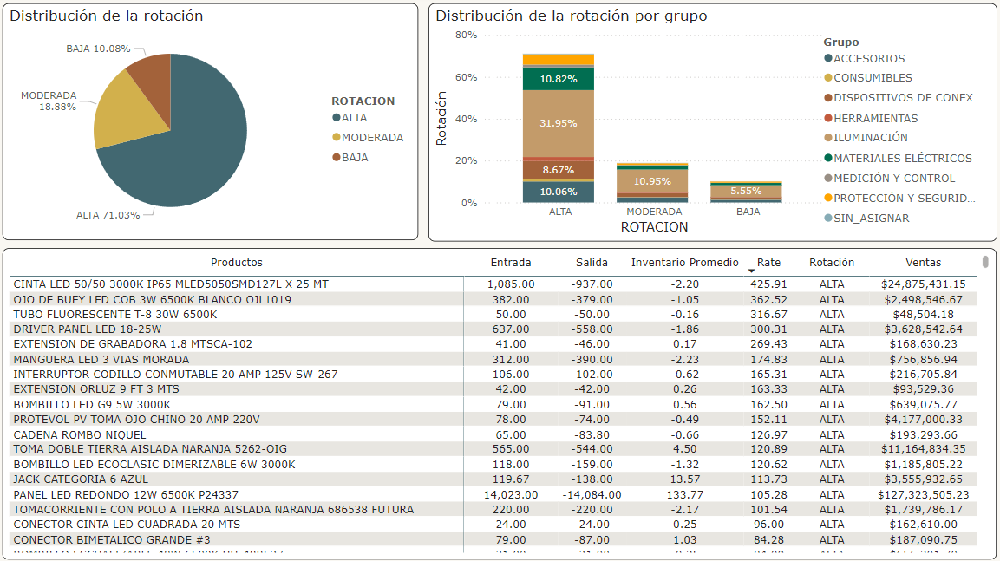
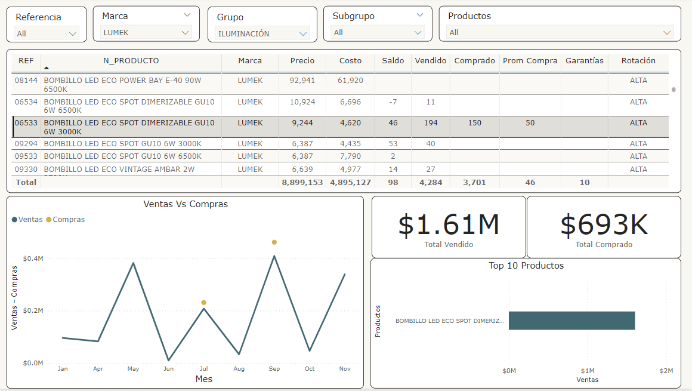

# Analisis-de-Datos-Informe-Rotacion-de-Inventario-Almacen-Electrocaribe

# Análisis de Rotación de Productos

## Caso de estudio 

Almacén Electrocaribe ltda no estudia la rotación de sus productos por medio de los datos, por los que se les propone realizar un estudio de este valor y tomarlo como KPI vital de la empresa, ya que maneja un amplio portafolio de productos. 

## Propuesta
Teniendo en cuenta el movimiento de los productos, hacer el cálculo de la rotación de inventario a los productos, categorizándolos como "Rotación Alta", "Rotación moderada" y "Rotación baja".

Usualmente este valor es cálculado con el costo del inventario y de los productos. Se hizo el análisis con estas variables pero existía un error contable que no permitió realizarlo con dichos valores. Lo cual, se optó hallarlo con la entrada y salida de los productos.

## Proceso
Se extajo la información de PostgreSQL por medio de querys. Se hizo el cálculo del inventario promedio por medio del saldo. Siendo un valor clave para el cálculo de la rotación.

Luego, se agruparon los datos de entrada y salida, pera hacer el cálculo de la rotación de los productos (Salida de Inventario / Inventario Promedio)

Se verificó la información por medio de las ventas, el kardex y el nuevo valor de rotación. obteniendo un valor confiable.

Por último, se categorizaron los productos de la siguiente forma:

- Rotación Alta: Rate de Rotación mayor a 2
- Rotación Moderada: Rate entre 0.9 t 1.99
- Rotación Baja: Rate menos a 0.9

## Aprendizaje y Conclusión

- Rotación de los productos 

- Superación de retos. 

- Análisis e investigación

## 🔗 Links

## Screenshots

### Reporte de Rotación de Productos

### Dashboard Pedidos:

